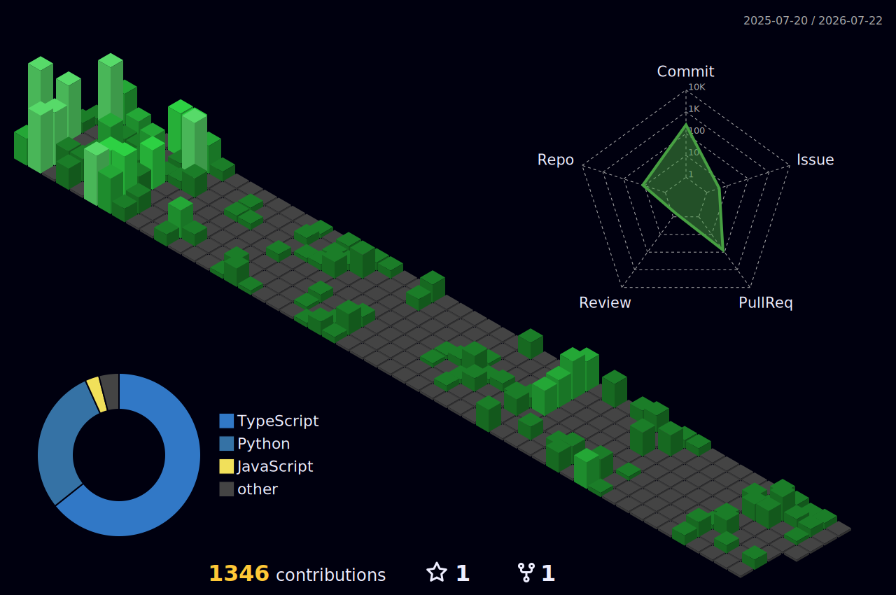

<h2 align="center">Hi 👋, I'm Raiyan — an Full-Stack Engineer from Dhaka</h2>

  <b>Building fast, scalable products with AI-native workflows and strong engineering fundamentals.</b> 
  I design and ship web and mobile applications that move quickly from idea to production, with a focus on clean architecture, maintainability, and performance.

  🔭 <b>Currently exploring:</b> NLP, RAG systems, and intelligent product workflows 
  🧠 <b>Background:</b> Machine learning, Python, Next.js, and scalable full-stack development

###

  
  

###

###

  
  
  
  
  
  
  
  
  
  
  
  
  
  
  
  
  
  
  
  
  
  
  
  
  
  
  
  
  
  
  
  
  
  
  

###

  
  
  

